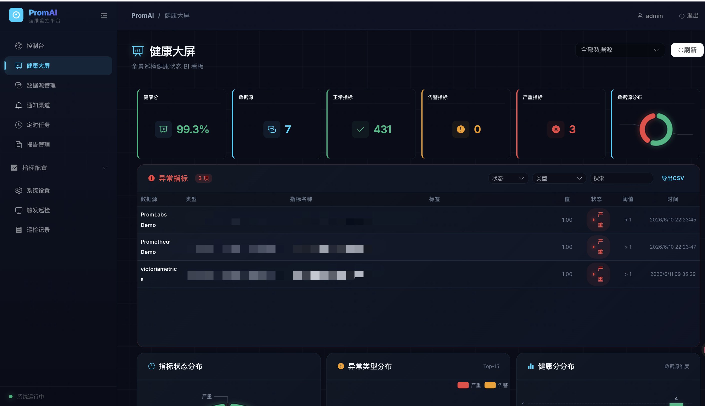
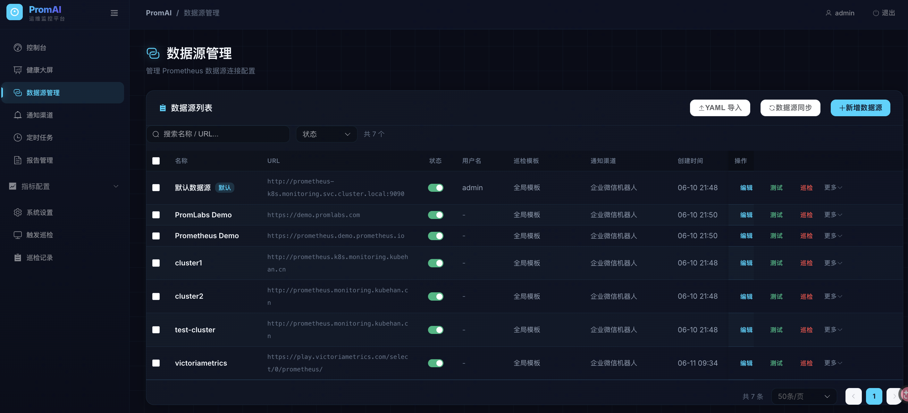
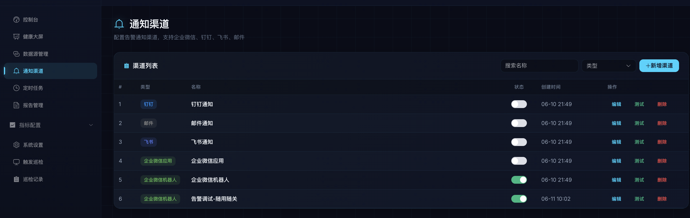
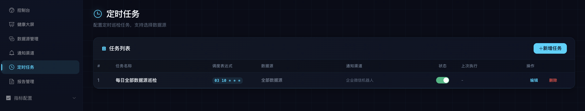
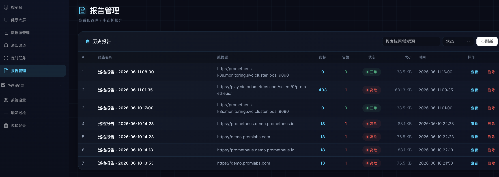
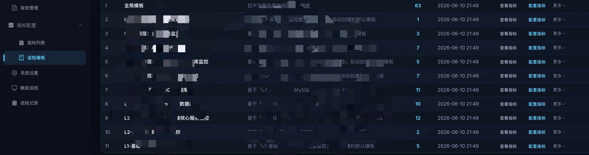
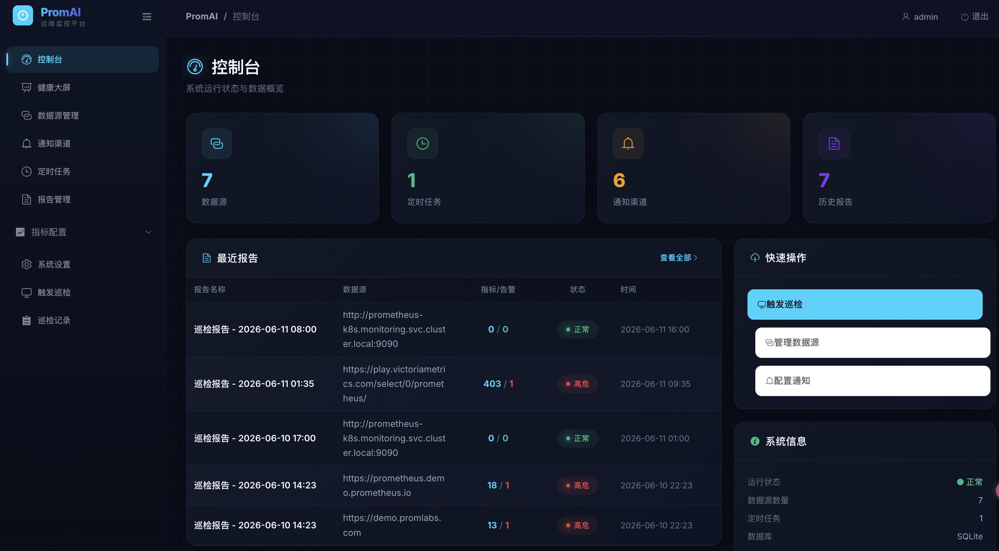
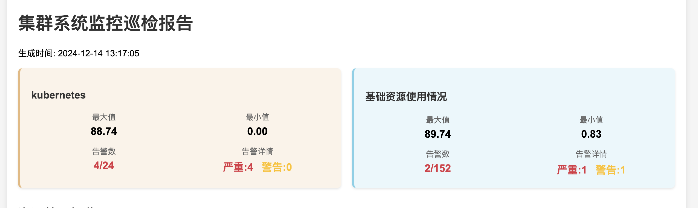
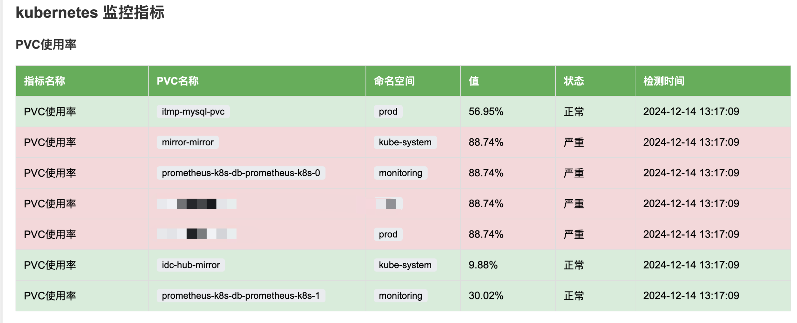

# Prometheus 监控报告生成器

> Prometheus Automated Inspection

## 项目简介

基于 Prometheus 的监控巡检工具，支持自动采集指标、生成可视化 HTML 报告，并提供 **Web 管理后台**（SQLite 持久化）进行数据源、指标、模板、定时任务、通知渠道的全生命周期管理。

## 管理后台表格规范

所有管理后台的列表型页面统一支持 **列级筛选、列级排序、组合筛选和分页**。

### 统一要求

- 每列支持筛选
- 每列支持升序/降序排序
- 支持多个列同时组合筛选
- 支持关键字筛选
- 支持枚举/状态类字段下拉筛选
- 支持时间范围筛选
- 支持一键清空筛选条件
- 切换分页后保留筛选和排序条件
- 数据量较大的列表使用服务端筛选、排序和分页，避免一次加载全部数据

### 适用页面

| 页面 | 列筛选 | 列排序 | 服务端分页 |
|------|--------|--------|------------|
| 数据源管理 | ✅ | ✅ | ✅ |
| 指标配置 | ✅ | ✅ | ✅ |
| 巡检模板 | ✅ | ✅ | ✅ |
| 模板指标 | ✅ | ✅ | ✅ |
| 通知渠道 | ✅ | ✅ | ✅ |
| 定时任务 | ✅ | ✅ | ✅ |
| 巡检记录 | ✅ | ✅ | ✅ |
| 报告管理 | ✅ | ✅ | ✅ |
| 告警记录 | ✅ | ✅ | ✅ |
| 用户管理 | ✅ | ✅ | ✅ |
| 审计日志 | ✅ | ✅ | ✅ |

### 筛选交互建议

文本字段使用关键字筛选，例如数据源名称、地址；状态、类型等枚举字段使用下拉筛选；创建时间、执行时间等时间字段支持时间范围筛选。

排序、筛选和分页参数由前端统一提交给后端 API，由后端转换为数据库查询条件并返回分页结果。

## 效果展示









## 快速开始

### 源码编译

1. 克隆仓库：

   ```bash
   git clone https://github.com/kubehan/PromAI.git
   cd PromAI
   ```

2. 安装依赖：

   ```bash
   go mod download
   cd frontend && npm install && cd ..
   ```

3. 修改配置文件 `config/config.yaml`，设置 Prometheus 地址

4. 构建前端 + 后端：

   ```bash
   cd frontend && npm run build 
   cd ..
   go build -o promai .
   ```

5. 运行：

   ```bash
   ./promai
   ```

   首次运行自动从 `config/config.yaml` 导入种子数据到 SQLite。

### 访问地址

| 用途 | 地址 |
|------|------|
| 首页 | http://localhost:8091/promai |
| 健康大屏（BI） | http://localhost:8091/promai/bi |
| 巡检报告 | http://localhost:8091/promai/reports |
| 触发巡检 | http://localhost:8091/promai/inspection/ |

### Helm 部署

```bash
helm install promai ./deploy/helm/promai \
  --set image.repository=promai \
  --set image.tag=v2.0.3
```

升级：

```bash
helm upgrade promai ./deploy/helm/promai \
  --set image.repository=promai \
  --set image.tag=v2.0.3
```

常用配置：

```yaml
env:
  reportUrl: "https://promai.example.com"
bootstrapSql:
  enabled: true
  content: |
    -- 自定义初始化 SQL
```

说明：
- `env.reportUrl` 用于生成报告外链，推荐配置成外部可访问地址。
- `deploy/helm/promai/files/metric_types_seed.sql` 是默认初始化 SQL。
- 如果需要自定义初始化内容，直接改 `bootstrapSql.content` 或替换 `files/metric_types_seed.sql`。

## 管理后台功能

| 页面 | 功能 |
|------|------|
| **控制台** | 系统概览，数据源/报告/模板/通知数量统计 |
| **健康大屏** | ECharts 图表展示各数据源健康评分、指标分布、告警统计 |
| **数据源管理** | 添加/编辑/删除 Prometheus 数据源，绑定巡检模板 |
| **指标配置** | 管理指标类型和 PromQL 配置，按数据源筛选，PromQL 验证 |
| **巡检模板** | 创建巡检模板，绑定指标，支持指标级别覆盖（不影响全局） |
| **通知渠道** | 配置钉钉、企业微信、飞书、邮件等通知方式 |
| **定时任务** | Cron 表达式定时巡检，选择通知渠道自动告警推送 |
| **触发巡检** | 手动触发巡检，支持选择数据源、指标、模板 |
| **报告管理** | 查看/删除历史巡检报告 |
| **系统设置** | 项目名称、调度 Cron、报告清理策略等 |

## 配置说明（config/config.yaml）

仅用于首次启动时的种子数据导入，后续所有配置通过管理后台 UI 操作，持久化在 SQLite。

```yaml
prometheus_url: "http://prometheus.k8s.kubehan.cn"
project_name: "PromAI"
cron_schedule: "00 08,17 * * *"

data_sources:
  - name: "cluster1"
    url: "http://prometheus.cluster1.example.com"
```

## 多数据源

通过管理后台「数据源管理」页面添加，每个数据源可独立绑定不同的巡检模板。

## 已实现的核心功能

- ✅ 多数据源支持
- ✅ SQLite 持久化（GORM）
- ✅ 巡检模板系统（模板指标覆盖）
- ✅ 智能告警（警告、严重两级告警）
- ✅ 管理后台 SPA（Vue 3 + Element Plus）
- ✅ 健康大屏（ECharts）
- ✅ 定时巡检（Cron 表达式）
- ✅ 多渠道通知（钉钉、企微、飞书、邮件）
- ✅ 数据导出（HTML 报告）
- ✅ PromQL 在线验证
- ✅ 响应式设计
- ✅ 管理后台列表统一支持列级筛选、排序、组合筛选和服务端分页

## 许可证

该项目采用 MIT 许可证，详细信息请查看 LICENSE 文件。
